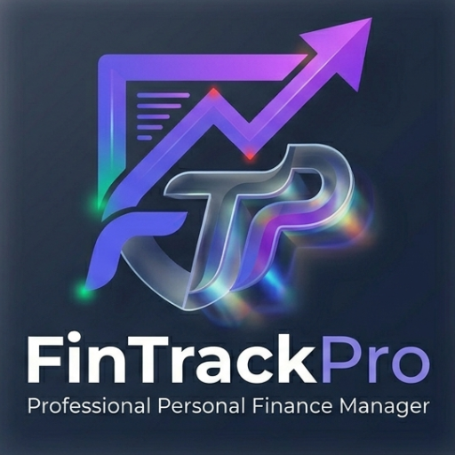

# 🛡️ FinTrackPro
### The Private, Offline-First Personal Finance Manager

FinTrackPro is a premium personal finance application built for users who value **privacy, security, and aesthetics**. Unlike traditional banking apps, FinTrackPro works entirely offline—your data never leaves your device.

## ✨ Core Features
- **📓 Notebook Ledger**: A daily transaction history designed like a clean, professional notebook.
- **🔒 Biometric Login**: Secure your data using Fingerprint or FaceID (WebAuthn).
- **📂 Offline-First (PWA)**: Works without an internet connection and can be installed as a native app on Android and iOS.
- **🤝 Debt Tracker**: Keep a dedicated ledger for money lent to friends or loans being repaid.
- **📊 Financial Analytics**: Visualize spending velocity and income vs. expense trends with interactive charts.
- **📤 Data Privacy**: Export your history to professional CSV statements or backup/restore via JSON files.

## 🛠️ Tech Stack
- **Frontend**: Vanilla HTML5, CSS3 (Modern Glassmorphism), JavaScript (ES6+).
- **Security**: Web Authentication API for biometric hardware integration.
- **Visualization**: Chart.js.
- **PWA**: Service Workers & Manifest for offline reliability.

## 🚀 How to Use
1. **Set your PIN**: On first run, create a 4-digit security code.
2. **Add Accounts**: Create your bank accounts, wallets, or cash ledgers.
3. **Track Spending**: Add transactions daily to see your "Daily Net Balance."
4. **Insights**: Visit the Insights tab to see your top spending categories and monthly summaries.

## 📦 Local Setup
1. Clone this repository.
2. Open `index.html` in any modern browser (using a local server like VS Code Live Server is recommended for Biometrics to work).

---
*Developed with ❤️ by **Shree Vishwakarma** for Financial Freedom.*
